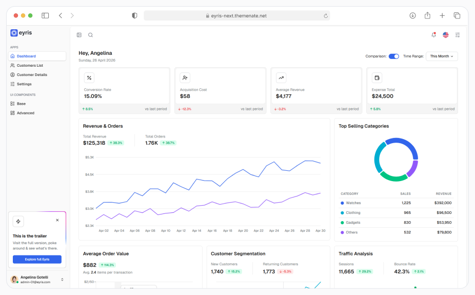

# Eyris Lite — React & Next.js Admin Template

Eyris Lite is a free Next.js 16 admin dashboard template of **[Eyris](https://themeforest.net/item/eyris-tailwind-admin-ui-kit/62526728)**, built with React 19, Tailwind CSS 4, and TypeScript. Skip the boilerplate: auth, dark mode, and a working dashboard are wired up.

The UI components are hand-built — written from scratch, not wrapped around Radix or pulled from a registry. Comes pre-configured for AI coding tools — `npm run ai-init` drops in rules and prompts for Claude Code, Cursor, Antigravity & etc. There's also an MCP server so your assistant can query the component library at runtime.

If you outgrow Lite, Eyris Pro has the complete set — every framework variant, layout, component, and app module.

[](https://eyris-next.themenate.net)
[](LICENSE)
[](https://nextjs.org)
[](https://tailwindcss.com)
[](https://www.typescriptlang.org)

**[Live Demo](https://eyris-next.themenate.net)** · **[Get Pro](https://themeforest.net/item/eyris-tailwind-admin-ui-kit/62526728)** · **[Documentation](https://static.themenate.net/eyris-doc/next/introduction/)** *(Pro)*


If Eyris saves you a weekend, [give it a star](https://github.com/themenate/eyris-lite) — it helps more devs find it.

---

## Quick start

```bash
git clone https://github.com/themenate/eyris-lite.git
cd eyris-lite
npm install
npm run dev
```

Open [http://localhost:3000](http://localhost:3000) — sign in with the seeded mock account and you're in.

---


## AI coding tools

Eyris ships two ways to bring your AI assistant up to speed: rule files (one-time setup) and a live MCP server (queryable at any time). Use one or both.

### 1. AI Init — drop in rule files

Run the interactive setup to install rules for the tools you use:

```bash
npm run ai-init                       # interactive
npm run ai-init -- --claude --cursor  # skip the prompt
```

| Tool | Flag | Output |
|---|---|---|
| Claude Code | `--claude` | `CLAUDE.md` + `.claude/rules/` + `.claude/commands/` |
| Cursor | `--cursor` | `.cursor/rules/eyris-*/RULE.md` |
| GitHub Copilot | `--copilot` | `.github/copilot-instructions.md` |
| Kiro | `--kiro` | `.kiro/steering/*.md` |
| Antigravity | `--antigravity` | `.agents/rules/` + `.agents/workflows/` |

The rules cover styling tokens, data fetching, auth, routing, naming conventions, and the new-page workflow. Existing files are never overwritten — delete and re-run to regenerate.

### 2. MCP server — query the component library at runtime

The MCP server exposes tools to look up component props, fetch code examples, scaffold pages, and configure the theme.

**Claude Code:**

```bash
claude mcp add eyris node /absolute/path/to/eyris-lite/mcp-server/dist/index.js
```

**Cursor / Kiro / Antigravity** — open the tool's MCP config and add:

```json
{
  "mcpServers": {
    "eyris": {
      "command": "node",
      "args": ["/absolute/path/to/eyris-lite/mcp-server/dist/index.js"]
    }
  }
}
```

The path must be absolute. Restart your assistant, then try:

```
"What props does DataTable accept?"
"Show me code examples for the Button component"
"Scaffold a CRUD list page for Tickets"
```

Available tools include `search_components`, `get_component`, `list_all_hooks`, `get_code_examples`, `add_new_page` and `configure_theme`. The server comes pre-built — only rebuild (`cd mcp-server && npm install && npm run build`) if you modify the source or add new component docs.

---

## Free vs Pro

|  | **Lite (Free)** | **Pro** |
|---|---|---|
| Framework | Next.js + TypeScript | Next.js TS · Next.js JS · Vite TS · Vite JS |
| Modules | Dashboard, customer list & details, settings | Sales, Customers, Accounts, Projects, Analytics, AI assistant, Crypto, HR, CRM |
| App layout | Default | 6 layout variants |
| Auth layout | Default | 3 layout variants |
| Icons | React Icons | React Icons + custom linear set |
| UI components | Essentials | Full library |
| Advanced components | Essentials | Full library |
| Starter pack | — | Included |

**Lite covers solo and side-project work. Pro is for agencies and teams that need the Vite or JS variants.**

[Get Eyris Pro on ThemeForest →](https://themeforest.net/item/eyris-tailwind-admin-ui-kit/62526728)

---

## Tech stack

- Next.js 16 (App Router) 
- React 19 
- TypeScript 5 
- Tailwind CSS 4 
- NextAuth.js 
- Zustand |
- React Hook Form + Zod 
- TanStack React Table 
- Charts | Recharts 
- Framer Motion
- next-intl 

---

## Community and support

- **Live demo** — [eyris-next.themenate.net](https://eyris-next.themenate.net)
- **Docs** — [static.themenate.net/eyris-doc/next/introduction](https://static.themenate.net/eyris-doc/next/introduction/) — written for the Pro version; some sections won't apply to Lite
- **Bugs / requests** — [open an issue](https://github.com/themenate/eyris-lite/issues)
- **Pro support** — included with [Eyris Pro on ThemeForest](https://themeforest.net/item/eyris-tailwind-admin-ui-kit/62526728)

---

## License

MIT — see [LICENSE](LICENSE). Build anything, sell anything, no attribution required. The Pro bundle ships under an extended commercial license suitable for SaaS and unlimited end products.

---

## Built with

Built and maintained by **[ThemeNate](https://themeforest.net/user/theme_nate/portfolio)**.
